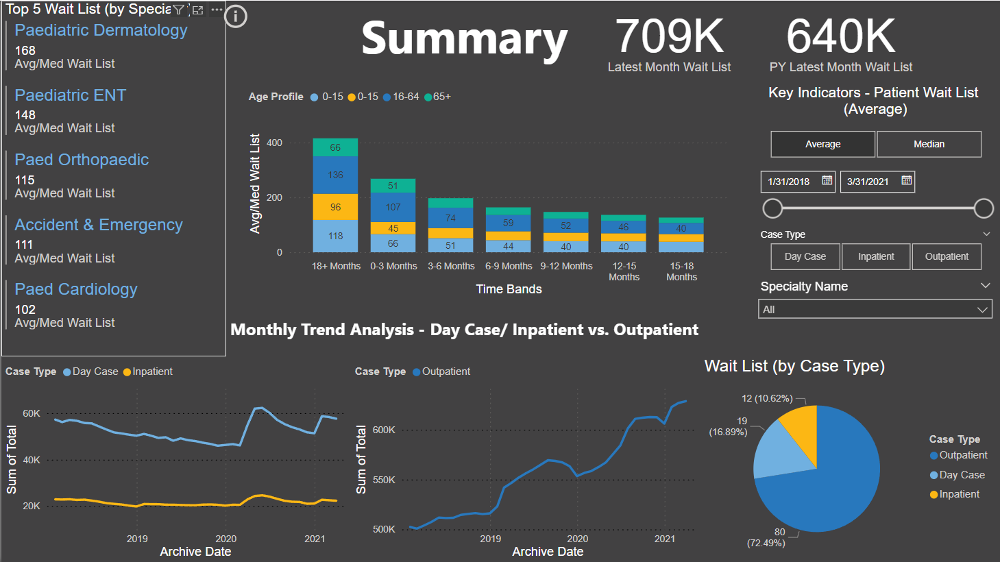

# Hospital Waitlist Dashboard

This repository contains a Power BI dashboard that visualizes hospital waitlist data for inpatient, outpatient, and day cases for the years 2018 to 2021. The dashboard provides insights into the current status, historical trends, and detailed analysis by specialty and age profile.

## Objectives

1. **Track Current Status of Patient Waiting List**
2. **Analyze Historical Monthly Trends of Waiting List in Inpatient and Outpatient Categories**
3. **Provide a Detailed Specialty Level and Age Profile Analysis**

## Metrics

- **Average Waiting List**
- **Median Waiting List**
- **Current Total Waiting List**

## Dashboard Pages

1. **Summary Page**
   - Provides an overview of the key metrics and trends.
2. **Detailed Page**
   - Allows for granular analysis with a matrix showing detailed data.

## Data Sources

The data was uploaded to Power BI as 6 different CSV files they can be found in the Data folder.

## Data Transformation Steps

1. **Load Data**
   - Inpatient and outpatient tables were loaded using the folder connector.
2. **Clean and Transform Data Using Power Query Editor**
   - **Transformations for Inpatient and Outpatient:**
     - Convert `Archive_date` to date format.
   - **Transformations for Outpatient:**
     - Add a column for `Case_Type` with each entry as "Outpatient".
3. **Append Tables**
   - Append the inpatient and outpatient tables together.

## How to Use This Repository

1. Clone the repository.
2. Open the Power BI file (`.pbix`) in Power BI Desktop.
3. Explore the different pages and visualizations to gain insights from the data.

## Repository Structure

- **Data/**
  - Contains the original CSV files used for the analysis.
- **Reports/**
  - Contains the Power BI file (`Healthcare_Report.pbix`).
- **README.md**
  - This file, providing an overview of the project.
- **background.png**
  - This file provides a background image for the README file.

## Acknowledgments

- Power BI for the analytics and visualization platform.

## Contact

For any questions or feedback, please contact George Zakhem at gelzakhem@gmail.com .
